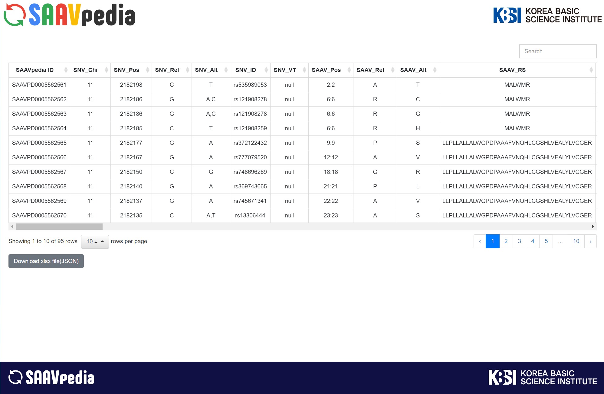

# SAAVpedia - neXtProt

## Features

+ Request the protein information using [SAAVpedia API](https://www.saavpedia.org/rest-api/).
+ Displays information in table format.
+ Save the information as an xlsx file.

## Functions

+ makeSearch
  + Request json data from SAAVpedia.
+ makeTable
  + Make table by [Bootstrap Table](https://bootstrap-table.com/).
+ exportExcel
  + Save as Excel file.

## preview

